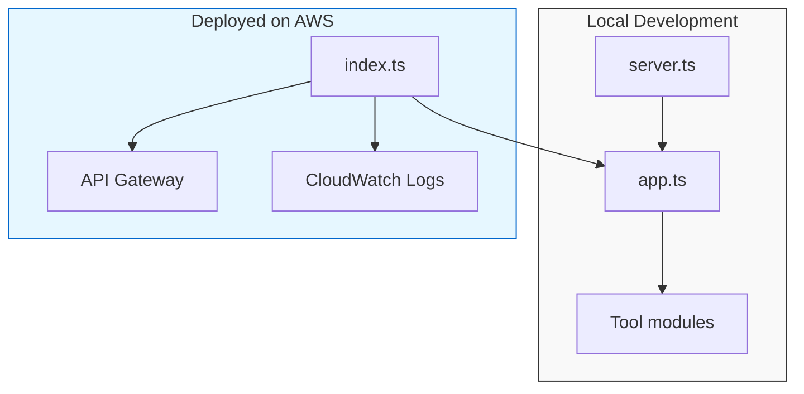

# Platform (AWS Lambda)

## Overview

AWS Lambda ベースの Model Context Protocol (MCP) Server および、そのデプロイのための AWS CDKアプリケーションです。
このパッケージは TypeScript で記述され、**pnpm** でビルドされます。

このパッケージは以下の形で利用できます。

* **デプロイ** – Lambda 関数として (`platform/lambda/index.ts`)。
* **ローカル実行** – 開発・デバッグ用に (`platform/lambda/server.ts`)。

両エントリーポイントは同一のコア実装 (`platform/lambda/app.ts`) を共有しています。

---

## Directory structure

```text
platform/
├─ bin/                # CLI utilities (e.g. platform.ts)
├─ lambda/             # Lambda source code
│  ├─ app.ts           # Core application logic
│  ├─ index.ts         # Lambda handler (AWS entry point)
│  ├─ server.ts        # Local HTTP server (development)
│  └─ tools/           # Example tool implementations
│     └─ WeatherTool.ts
├─ lib/                # CDK stack definition
│  └─ platform-stack.ts
├─ .gitignore
├─ .npmignore
├─ cdk.json
├─ eslint.config.ts
├─ package.json
├─ README.md           # ← this file
├─ tsconfig.json
└─ viteest.config.ts
```

---

## Prerequisites

* **Node.js** ≥ 22 (LTS)
* **pnpm** – 未インストールの場合は `npm i -g pnpm` でインストール

---

## Installation

```bash
# リポジトリのルートから実行
pnpm install
# platform ワークスペースだけをインストール
pnpm --filter platform install
```

---

## Development

### Local server

`platform/lambda/server.ts` は Lambda 環境を模倣した HTTP サーバを起動します。素早い反復開発とデバッグに便利です。

```bash
# リポジトリのルートから実行
pnpm --filter platform run dev
```

`package.json` に定義されているスクリプトは以下の通りです。

```json
{
  "scripts": {
    "dev": "ts-node-esm lambda/server.ts"
  }
}
```

* **デフォルトポート** – `8080`
* `PORT` 環境変数で上書き可能

サーバ起動時に **ローカル開発モード** であることを示すバナーが表示されます。

### Building

```bash
pnpm --filter platform run build
```

`build` は TypeScript ソースを `dist/` ディレクトリへコンパイルし、`tsconfig.json` の設定を使用します。

### Testing

ユニットテストは `platform/__tests__` 以下に配置されています。実行方法は次の通りです。

```bash
pnpm --filter platform test
```

---

## Deployment

`lib/platform-stack.ts` で定義された CDK スタックが Lambda 関数や関連リソースをプロビジョニングします。デプロイは以下のコマンドで行います。

```bash
cdk deploy --app "pnpm --filter platform run build && node dist/lambda/index.js"
```

> **注意** – 必要に応じて CDK のブートストラップや AWS クレデンシャルを設定してください。

---

## Architecture diagram



* コア (`app.ts`) はローカルサーバとデプロイされた Lambda ハンドラの間で共有されます。
* ツールモジュール（例: `WeatherTool.ts`）は `app.ts` からインポートされます。

---

## Contributing

1. リポジトリをフォークします。
2. フィーチャーブランチを作成します (`git checkout -b feat/your-feature`)。
3. `pnpm install` と `pnpm test` を実行し、既存テストがすべてパスすることを確認します。
4. 変更内容を明確に記述したプルリクエストを提出します。

---

## License

トップレベルの `LICENSE` ファイルをご参照ください。
